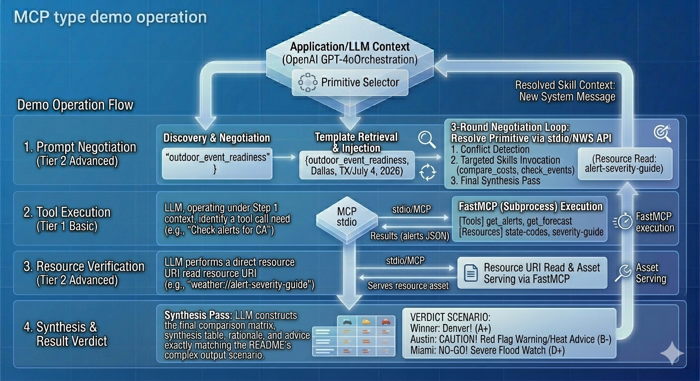
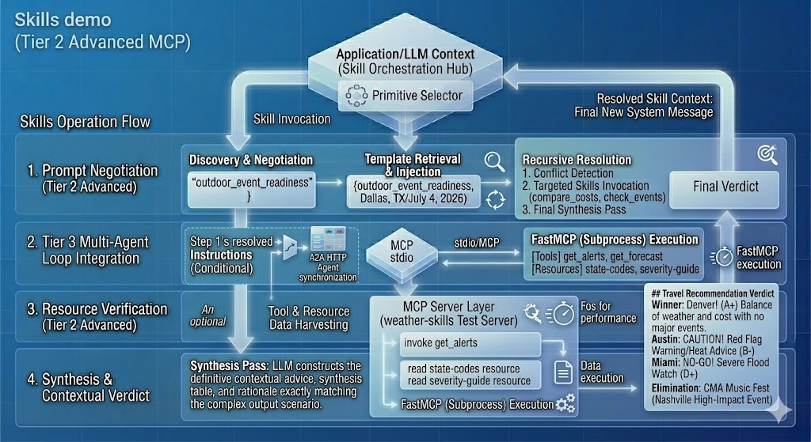
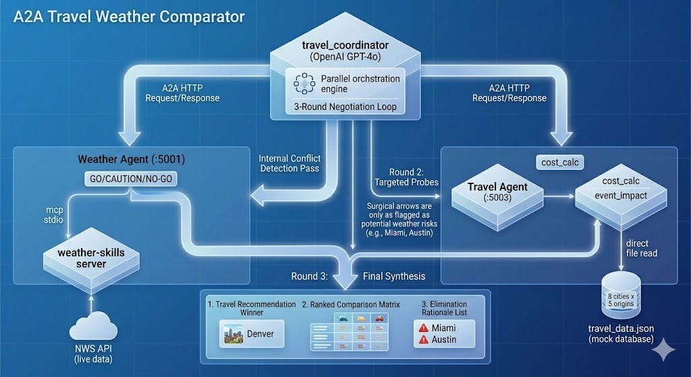

# AI Skills, MCP and A2A 

A hands-on demonstration of three AI agent communication patterns — MCP (Model Context Protocol), Skills/Prompts, and A2A (Agent-to-Agent). The project is structured as three learning tiers, each building on the last.

## Project Structure

```
ai-mcp-and-skills/
├── weather/                    # TIER 1 — Basic MCP server (tools only)
│   ├── weather.py
│   └── pyproject.toml
├── mcp-client/                 # TIER 1 — Basic MCP client (free-form chat)
│   ├── client.py
│   ├── .env.example
│   └── pyproject.toml
├── weather-skills/             # TIER 2 — Advanced MCP server (tools + resources + skills)
│   ├── weather_server.py
│   ├── state_codes.json
│   └── pyproject.toml
├── skills-client/              # TIER 2 — Advanced MCP client (full primitive explorer)
│   ├── client.py
│   ├── ask.py
│   ├── .env.example
│   └── pyproject.toml
├── a2a-travel-comparator/      # TIER 3 — A2A multi-agent travel planner
│   ├── a2a_protocol.py         #   Base A2A protocol layer
│   ├── weather_agent.py        #   A2A server :5001 → MCP → NWS API
│   ├── travel_agent.py         #   A2A server :5003 → travel_data.json
│   ├── travel_coordinator.py   #   OpenAI orchestrator, 3-round negotiation
│   ├── travel_data.json        #   Mock data: 8 cities × 5 origins
│   ├── start.ps1               #   One-command startup script
│   └── pyproject.toml
└── test_openai.py              # Smoke-test for OpenAI API connectivity
```

---

## Tier 1 — Basic

A minimal MCP server + client. Good starting point for understanding how MCP tools work.



### `weather/` — Basic MCP Server

An MCP server backed by the free [National Weather Service API](https://api.weather.gov) exposing two tools:

| Tool | Description |
|------|-------------|
| `get_alerts` | Active weather alerts for a US state (two-letter code) |
| `get_forecast` | 5-period forecast for a lat/lon coordinate |

### `mcp-client/` — Basic MCP Client

A minimal chat shell. Type any question and GPT-4o automatically calls MCP tools as needed. No slash commands — just plain queries.

**Setup & run:**

```bash
cd weather
uv sync

cd ../mcp-client
uv sync
cp .env.example .env   # add your OPENAI_API_KEY

uv run python client.py ../weather/weather.py
```

**Example:**

```
Connected to server with tools: ['get_alerts', 'get_forecast']

Query: Are there any weather alerts in Florida?
  -> Calling tool: get_alerts({'state': 'FL'})

Active alerts for FL: ...
```

---

## Tier 2 — Advanced

Extends the basic pair with MCP Resources and Prompts (Skills), plus a feature-rich client that lets you explore all three primitives interactively.



### `weather-skills/` — Advanced MCP Server

All three MCP primitive types:

| Primitive | Name | Description |
|-----------|------|-------------|
| **Tool** | `get_alerts` | Active weather alerts for a US state |
| **Tool** | `get_forecast` | 5-period forecast for a lat/lon coordinate |
| **Resource** | `weather://state-codes` | JSON map of state abbreviations → full names |
| **Resource** | `weather://alert-severity-guide` | NWS severity levels and recommended actions |
| **Prompt** | `outdoor_event_readiness` | Advises whether an outdoor event is safe to hold |
| **Prompt** | `severe_weather_briefing` | Structured emergency briefing for a US state |
| **Prompt** | `multi_day_trip_planner` | Weather-optimized itinerary for multiple destinations |

### `skills-client/` — Advanced MCP Client

An interactive CLI shell that discovers and exercises all MCP primitives.

| Command | Description |
|---------|-------------|
| `/tools` | List available MCP tools |
| `/resources` | List available MCP resources |
| `/resource <uri>` | Read a specific resource (e.g. `weather://state-codes`) |
| `/skills` | List available prompts/skills |
| `/skill <name>` | Invoke a skill interactively (prompts for arguments) |
| `quit` | Exit |

Any other input is treated as a free-form query sent to GPT-4o with all server tools available.

**Setup & run:**

```bash
cd weather-skills
uv sync

cd ../skills-client
uv sync
cp .env.example .env   # add your OPENAI_API_KEY

uv run python client.py ../weather-skills/weather_server.py
```

**Example:**

```
--- Connected to MCP Server ---
  Tools:     ['get_alerts', 'get_forecast']
  Resources: ['weather://state-codes', 'weather://alert-severity-guide']
  Skills:    ['outdoor_event_readiness', 'severe_weather_briefing', 'multi_day_trip_planner']
-------------------------------

Query: /skill outdoor_event_readiness
Skill 'outdoor_event_readiness' requires:
  location (required): Austin, TX
  date (required): 2025-07-04
  event_type (required): outdoor concert

Invoking skill 'outdoor_event_readiness'...
  -> Calling tool: get_alerts({'state': 'TX'})
  -> Calling tool: get_forecast({'latitude': 30.27, 'longitude': -97.74})
...
```

---

## Tier 3 — A2A Travel Weather Comparator

A multi-agent system that compares travel destinations by combining **live weather data** (via MCP) with **travel costs and events** (via mock data). Three agents communicate over HTTP using a custom A2A protocol and a 3-round OpenAI negotiation loop to produce a ranked recommendation.

### Architecture



```
travel_coordinator.py  (OpenAI GPT-4o — orchestrator)
        │
        ├── A2A HTTP :5001 ──► weather_agent.py ──► MCP stdio ──► weather_server.py ──► NWS API
        │                      (GO/CAUTION/NO-GO per city)
        │
        └── A2A HTTP :5003 ──► travel_agent.py ──► travel_data.json
                               (flight costs, hotel rates, events)
```

### Components

| File | Role |
|------|------|
| `a2a_protocol.py` | Base layer — `AgentCard`, `A2ATask`, `A2AResult`, `A2AServer`, `A2AClient` |
| `weather_agent.py` | A2A server on `:5001`. Bridges A2A → MCP → `weather_server.py`. Returns `GO / CAUTION / NO-GO` per city |
| `travel_agent.py` | A2A server on `:5003`. Exposes two skills: `compare_travel_costs` and `check_events_impact` |
| `travel_coordinator.py` | OpenAI-driven orchestrator. Parses natural-language queries, fans out parallel A2A tasks, runs 3-round negotiation |
| `travel_data.json` | Mock data for 8 cities: Austin, Miami, Denver, San Francisco, Nashville, Seattle, Phoenix, New Orleans |

### 3-Round Negotiation Loop

| Round | Name | What Happens |
|-------|------|-------------|
| **1** | Parallel Assessment | `asyncio.gather` fires N weather tasks + 1 travel task simultaneously |
| **2** | Conflict Detection | OpenAI flags mismatches (e.g. cheapest city has NO-GO weather). Fires targeted `check_events_impact` calls only for flagged cities |
| **3** | Final Synthesis | Produces a `Winner`, comparison table, eliminated cities list, and travel tips |

### Cities & Origins

**Destination cities (8):** Austin · Miami · Denver · San Francisco · Nashville · Seattle · Phoenix · New Orleans

**Departure origins (5):** New York · Los Angeles · Chicago · Dallas · Atlanta

### Setup & Run

```powershell
cd a2a-travel-comparator
uv sync
```

Start all three agents with one command:

```powershell
.\start.ps1
```

This script:
1. Kills any stale processes on ports 5001 and 5003
2. Opens the Weather Agent in a new window — waits for port 5001 to be ready
3. Opens the Travel Agent in a new window — waits for port 5003 to be ready
4. Launches the coordinator interactively in the current terminal

### Example Queries

```
Compare Austin, Nashville, and Denver from Chicago for 5 nights in June 2026
```
```
Compare Miami, New Orleans, and Nashville from New York for 4 nights in February 2026
```
```
Where should I travel from Dallas for a long weekend in October 2026 — Austin, Nashville, or New Orleans?
```

### Example Output

```
============================================================
Round 1: Initial Parallel Assessment
============================================================
  Cities:  ['Austin', 'Nashville', 'Denver']
  Origin:  Chicago  |  Dates: 2026-06-01 to 2026-06-06  |  Nights: 5
  Sending 3 weather tasks + 1 travel task in parallel...

  Weather verdicts: {'Austin': 'CAUTION', 'Nashville': 'CAUTION', 'Denver': 'CAUTION'}
  Cost ranking:     ['Nashville', 'Denver', 'Austin']

============================================================
Round 2: Conflict Detection
============================================================
  1 conflict(s) found:
    • Nashville has a High-impact event (CMA Music Festival) during travel dates

============================================================
Round 3: Final Synthesis
============================================================

## Travel Recommendation
**Winner: Denver** — best balance of manageable weather and cost with no major event disruptions.

### City Comparison
| City      | Weather | Total Cost | Travel Time | Active Alerts      | Events           | Verdict  |
|-----------|---------|------------|-------------|---------------------|------------------|----------|
| Nashville | CAUTION | $910       | 2.0 hrs     | None                | CMA Fest (High)  | CAUTION  |
| Denver    | CAUTION | $1,000     | 2.5 hrs     | Red Flag Warning    | None             | CAUTION  |
| Austin    | CAUTION | $1,140     | 2.5 hrs     | Severe Flood Alerts | None             | CAUTION  |

### Eliminated Cities
- **Austin**: Severe flood alerts pose significant travel risk
- **Nashville**: CMA Music Festival causes overcrowding and hotel price surge

### Travel Tips for Denver
- Monitor Red Flag Warning conditions — avoid open fires
- Pack layers for cooler evenings despite warm daytime temperatures
- Book accommodation early; Denver fills up in summer
```

---

## Quick Demo Guide

### Tier 1 — MCP Demo (Tools only)

```powershell
cd c:\local-repo\ai-mcp-and-skills\mcp-client
uv run python client.py ..\weather\weather.py
```

```
Connected to server with tools: ['get_alerts', 'get_forecast']

MCP Client Started!
Type your queries or 'quit' to exit.

Query: Are there any weather alerts in Texas?
  -> Calling tool: get_alerts({'state': 'TX'})

Active alerts for TX: ...
```

Suggested questions:
```
What is the weather forecast for Los Angeles, California?
Should I travel to Houston Texas this weekend? Check alerts and the forecast.
What weather warnings are active in Florida?
```

---

### Tier 2 — MCP Demo (Tools + Resources + Skills)

```powershell
cd c:\local-repo\ai-mcp-and-skills\skills-client
uv run python client.py ..\weather-skills\weather_server.py
```

```
--- Connected to MCP Server ---
  Tools:     ['get_alerts', 'get_forecast']
  Resources: ['weather://state-codes', 'weather://alert-severity-guide']
  Skills:    ['outdoor_event_readiness', 'severe_weather_briefing', 'multi_day_trip_planner']
-------------------------------

Query: What is the temperature in Chicago?
  -> Calling tool: get_forecast({'latitude': 41.8781, 'longitude': -87.6298})

The current temperature in Chicago is 59°F. Mostly cloudy with northeast winds
around 15 mph, gusts as high as 25 mph.
```

**Skill commands to try:**
```
/skills                          ← list all available skills
/skill severe_weather_briefing   ← enter state: TX
/skill outdoor_event_readiness   ← enter: Dallas TX / 2026-07-04 / outdoor concert
/skill multi_day_trip_planner    ← enter: Austin TX, Miami FL, Denver CO
```

**One-shot query (no interactive shell):**
```powershell
cd c:\local-repo\ai-mcp-and-skills\skills-client
uv run python ask.py "Are there any weather alerts in California?"
```

---

### Tier 3 — A2A Travel Comparator Demo

```powershell
cd c:\local-repo\ai-mcp-and-skills\a2a-travel-comparator
.\start.ps1
```

The script opens Weather Agent (port 5001) and Travel Agent (port 5003) in separate windows, waits for both to be ready, then launches the coordinator interactively:

```
============================================
   Travel Weather Comparator — Startup
============================================
[1/4] Cleaning up stale processes...
[2/4] Starting Weather Agent (port 5001)...
  Waiting for Weather Agent on port 5001 ......READY
[3/4] Starting Travel Agent (port 5003)...
  Waiting for Travel Agent on port 5003 ...READY
[4/4] Both agents ready. Launching coordinator...

Query: Compare Austin, Nashville, and Denver from Chicago for 5 nights in June 2026

============================================================
Round 1: Initial Parallel Assessment
============================================================
  Sending 3 weather tasks + 1 travel task in parallel...
  Weather verdicts: {'Austin': 'CAUTION', 'Nashville': 'CAUTION', 'Denver': 'CAUTION'}
  Cost ranking:     ['Nashville', 'Denver', 'Austin']

Round 2: Conflict Detection
  1 conflict(s) found:
    • Nashville has a High-impact event (CMA Music Festival) during travel dates

Round 3: Final Synthesis

## Travel Recommendation
**Winner: Denver** — best weather/cost balance with no major event conflicts.
```

Suggested questions:
```
Compare Austin, Nashville, and Denver from Chicago for 5 nights in June 2026
Compare Miami, New Orleans, and Nashville from New York for 4 nights in February 2026
Where should I travel from Dallas for a long weekend in October 2026 — Austin, Nashville, or New Orleans?
```

---

## Prerequisites

- Python 3.10+
- [uv](https://docs.astral.sh/uv/) package manager
- OpenAI API key

## Testing

### Integration test — advanced server

Exercises all MCP primitives (tools, resources, prompts) against the live NWS API without needing an OpenAI key:

```bash
cd weather-skills
uv run python test_server.py
```

Expected output:

```
=== MCP server initialized ===

Tools found: ['get_alerts', 'get_forecast']
  [PASS] list_tools
  [PASS] get_alerts(CA) → Active alerts for CA: ...
  [PASS] get_forecast(Austin TX) → Forecast: ...
  [PASS] get_forecast(0,0) raises for non-US coordinates (expected)

Resources found: ['weather://state-codes', 'weather://alert-severity-guide']
  [PASS] list_resources
  [PASS] read state-codes → CA=California, TX=Texas
  [PASS] read alert-severity-guide → 5 levels

Prompts found: ['outdoor_event_readiness', 'severe_weather_briefing', 'multi_day_trip_planner']
  [PASS] list_prompts
  ...

=== All tests complete ===
```

### OpenAI connectivity smoke-test

```bash
# from the repo root (requires OPENAI_API_KEY in .env)
python test_openai.py
```

## How It Works

**Tier 1 & 2 — MCP**
```
┌────────────┐   stdio/MCP   ┌───────────────┐
│   client   │ ◄───────────► │    server     │
│ (OpenAI)   │               │  (NWS API)    │
└────────────┘               └───────────────┘
```
1. The client launches the server as a subprocess and connects over stdin/stdout.
2. It discovers tools (and optionally resources/prompts) via MCP initialization.
3. User queries go to GPT-4o; tool calls are routed back through the MCP session.
4. For skills, the prompt template is fetched from the server and injected as the system message.

**Tier 3 — A2A**
```
┌─────────────────┐   A2A HTTP   ┌──────────────────┐   MCP stdio   ┌──────────────┐
│  Coordinator    │ ────────────► │  Weather Agent   │ ────────────► │weather_server│
│  (OpenAI)       │              └──────────────────┘               └──────────────┘
│                 │   A2A HTTP   ┌──────────────────┐
│                 │ ────────────► │  Travel Agent    │
└─────────────────┘              └──────────────────┘
```
1. The coordinator parses the query with GPT-4o to extract cities, origin, dates, and duration.
2. It fans out all weather and travel tasks simultaneously via `asyncio.gather`.
3. GPT-4o analyses conflicts between verdicts and costs in Round 2.
4. A final GPT-4o pass synthesises the winner, table, and travel tips in Round 3.

## Dependencies

| Package | Used in | Purpose |
|---------|---------|---------|
| `mcp[cli]` | weather, weather-skills | MCP server framework (FastMCP) |
| `httpx` | weather, weather-skills, a2a | Async HTTP client |
| `mcp` | mcp-client, skills-client, weather_agent | MCP client session |
| `openai` | mcp-client, skills-client, coordinator | GPT-4o chat completions + tool use |
| `fastapi` | weather_agent, travel_agent | A2A HTTP server |
| `uvicorn` | weather_agent, travel_agent | ASGI server |
| `pydantic` | a2a_protocol | A2A data models |
| `python-dotenv` | mcp-client, skills-client, coordinator | Load `.env` for API key |
